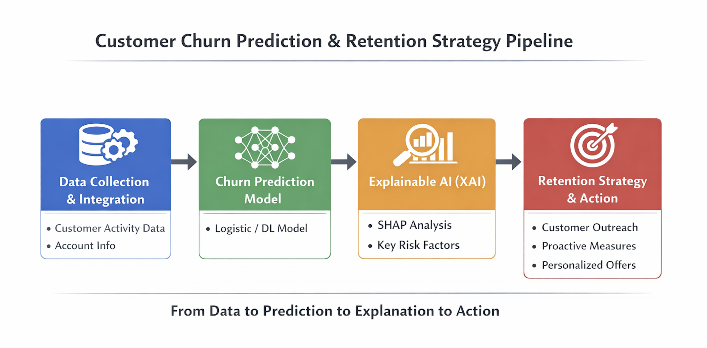
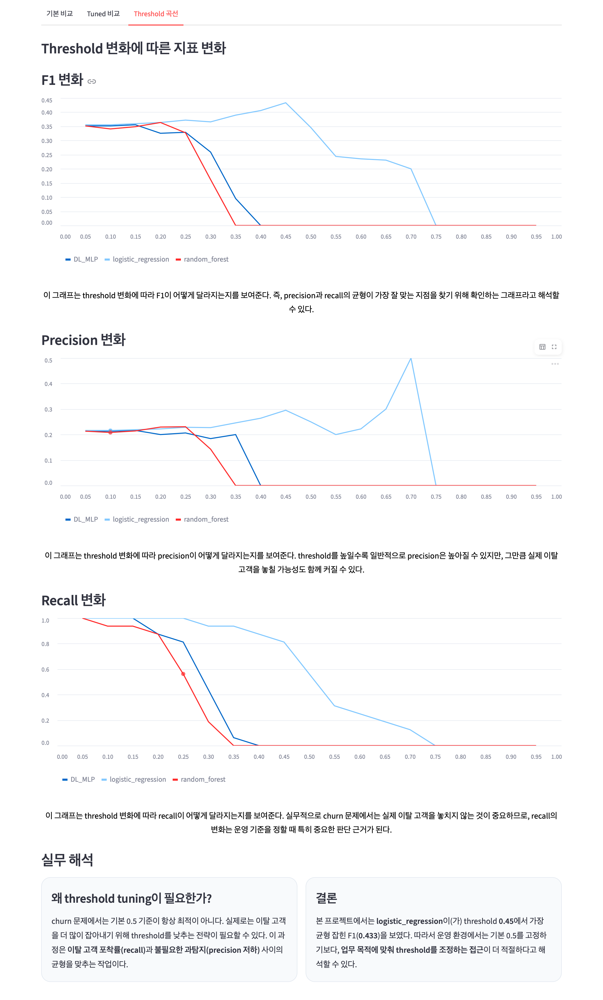
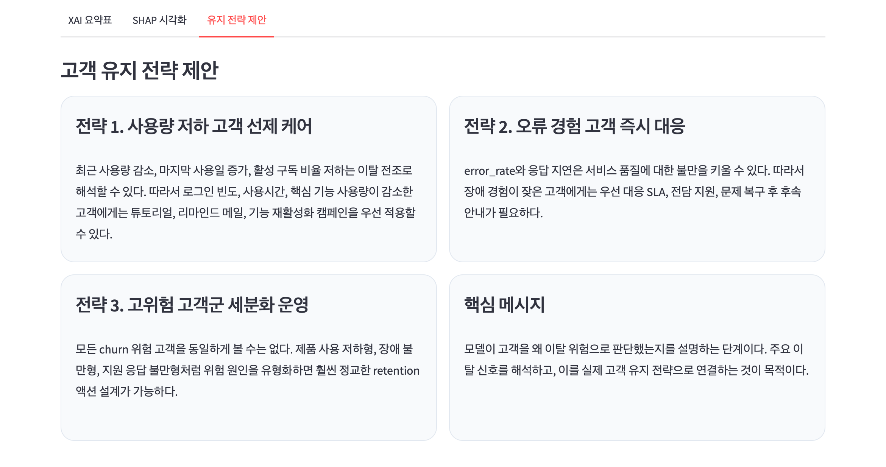

# Kaggle 데이터를 활용한 XAI 기반 고객 이탈 예측 프로젝트

## 프로젝트 개요

이 프로젝트는 SaaS 환경에서 고객 이탈(churn)을 사후적으로 설명하는 데 그치지 않고, **이탈 가능성이 높은 account를 사전에 식별하고, 그 판단 근거를 설명 가능하게 제시하며, 최종적으로 실행 가능한 retention 전략으로 연결하는 것**을 목표로 한다.

단일 테이블 예측 문제가 아니라,  
`accounts`, `subscriptions`, `feature_usage`, `support_tickets` 등 **서로 다른 grain을 갖는 다중 테이블 구조**를 실제 비즈니스 의사결정 단위인 **account 수준으로 통합**했다는 점이 이 프로젝트의 핵심이다.

- 주제: 설명 가능한 SaaS 고객 이탈 예측 및 고객 유지 전략 분석
- 데이터셋: RavenStack Synthetic SaaS Dataset
- 분석 단위: account 기준 (500개)
- 입력 변수 수: 74개
- 타깃 변수: `churn_flag`
- Churn 비율: 22.0%
- 운영 최적 threshold: 0.45
- 최고 F1: 0.433
- 배포: [🔗 Streamlit 대시보드](https://ravenstack-churn-project.streamlit.app)
- 전자책: [프로젝트 기술서 바로가기](https://wikidocs.net/book/19571)
<p align="center">
  
</p>

---

## 프로젝트가 해결하려는 문제

SaaS 서비스에서는 고객이 이미 떠난 뒤 원인을 정리하는 것보다, **이탈 가능성이 높아진 시점을 조기에 탐지하고 개입하는 것**이 훨씬 중요하다.

하지만 churn 문제는 단순히 “사용량이 줄면 떠난다”는 식으로 설명되지 않는다.  
실제로는 구독 변화, 기능 사용 패턴, 오류 경험, 고객 지원 응답 지연, 최근 활동성 저하 등 여러 신호가 복합적으로 작동한다.

따라서 본 프로젝트는 다음 질문에 답하도록 설계되었다.

1. 어떤 고객이 이탈할 가능성이 높은가?
2. 모델은 왜 그 고객을 위험하다고 판단했는가?  
3. 그 판단을 어떤 고객 유지 전략으로 연결할 수 있는가?

---

## 프로젝트 흐름



---

## 분석 흐름

```text
문제 정의
→ 데이터 구조 이해 및 account 단위 통합
→ EDA를 통한 churn 신호 탐색
→ feature engineering 및 전처리
→ ML / DL 모델 비교
→ threshold tuning
→ SHAP 기반 해석
→ retention 전략 제안
```

## 데이터 구조 이해 (Data Understanding & Integration)

### 왜 account 단위로 통합했는가

이 프로젝트의 타깃 변수 `churn_flag`는 `accounts` 테이블에 존재한다.  
또한 실제 SaaS 비즈니스에서도 세일즈, CRM, CSM 개입은 subscription 하나가 아니라 **고객 account 단위**로 이뤄지는 경우가 많다.

따라서 본 프로젝트는 모든 데이터를 `account_id` 기준으로 통합하는 전략을 채택하였다.

### 원천 데이터 구조

| 파일명 | 분석 단위 | 주요 역할 |
|--------|-----------|-----------|
| `accounts.csv` | account | 고객 기본 정보 및 churn 타깃 |
| `subscriptions.csv` | account / subscription | 구독 이력 및 플랜 변화 |
| `feature_usage.csv` | subscription | 기능 사용 로그 |
| `support_tickets.csv` | account | 고객 문의 및 지원 이력 |
| `churn_events.csv` | account | 사후 이탈 이벤트 및 원인 |

### 통합 과정에서 중요했던 기술적 포인트

- `feature_usage`는 subscription 단위이므로 바로 학습에 사용할 수 없었고, **account 수준 집계(feature aggregation)** 가 필요했다.
- `subscriptions`는 단순 건수보다 **활성 구독 비율, 평균 구독 기간, 최근 업그레이드 여부**처럼 상태 변화를 반영하는 feature로 재구성했다.
- `support_tickets`는 단순 문의 수보다 **응답 지연, escalation 비율, 오류 관련 경험**이 churn 신호가 될 수 있도록 가공했다.
- `churn_events`는 이탈 이후 생성된 정보이므로 **예측 모델 학습에서는 의도적으로 제외**했다. 이는 성능을 높이는 대신 일반화 성능을 무너뜨릴 수 있는 **데이터 누수(leakage)** 를 방지하기 위한 설계다.

### 데이터 설계 관점에서의 의미

즉, 본 프로젝트는 단순 join이 아니라 **서로 다른 관측 단위를 account 관점의 feature space로 변환하는 과정**에 가깝다.

---

## 데이터 전처리 및 Feature Engineering

### 1. 결측치 처리

본 프로젝트에서는 결측치를 단순히 제거하지 않았다.

그 이유는 SaaS 데이터에서 결측은 종종 “정보가 없음”이 아니라 **그 행동이 일어나지 않았음** 또는 **그 정보가 수집되지 않았음** 자체가 신호가 될 수 있기 때문이다.

따라서 다음 전략을 적용했다.

- 수치형 값: 대체(imputation)
- 결측 발생 여부: 별도 flag 변수 생성

예를 들어 `satisfaction_score`가 비어 있다는 사실 자체가 고객 접점 부족 또는 피드백 부재의 신호일 수 있으므로, 값 보정과 결측 여부를 분리해서 보존했다.

### 2. 범주형 처리 및 스케일링

- 범주형 변수: One-Hot Encoding
- 수치형 변수: StandardScaler
- 모델 특성에 따라 동일 입력을 ML / DL 파이프라인에 맞게 재구성

### 3. 파생변수 생성 방향

단순 원천 변수보다, churn과 직접 연결될 가능성이 높은 구조적 feature를 만드는 데 집중했다.

예시:
- `active_subscription_ratio`
- `usage_per_subscription`
- `error_per_subscription`
- `days_since_last_usage`
- `recent_upgrade_90d`
- `avg_first_response_time_minutes`

이러한 변수들은 “많이 썼는가”보다 **“얼마나 건강한 방식으로 사용하고 있었는가”**를 더 잘 반영한다.

---

## EDA: 이탈은 단순 사용량 감소로 설명되지 않았다

초기 가설은 일반적인 churn 문제처럼 “사용량이 줄고, 활동성이 낮아지면 이탈한다”는 것이었다.

그러나 EDA 결과, 이탈 고객이 오히려 일부 사용량 지표에서 더 높게 나타나는 구간이 확인되었다.  
이는 단순 usage level만으로 churn을 설명하기 어렵고, **사용량의 양보다 사용의 질과 맥락**이 더 중요하다는 점을 시사한다.

### 주요 관찰

- Churn 비율 22% → 불균형 분류 문제
- 일부 usage 지표는 churn 고객이 더 높음
- `health_score` 단독 효과는 제한적
- `total_subscriptions` ↔ `active_subscriptions`
- `total_usage_count` ↔ `total_usage_duration_secs`

이런 패턴은 다음 해석으로 이어졌다.

1. 많이 쓰는 고객도 떠날 수 있다  
2. 사용량 그 자체보다 오류, 응답 지연, 최근 비활성화, 구독 구조 변화가 더 중요할 수 있다  
3. 따라서 feature engineering과 threshold 조정이 핵심이다

---

## 모델링 전략: 성능, 해석, 운영을 분리해서 봤다

본 프로젝트는 단일 “최종 모델 1개”를 고르는 접근보다, **목적별로 모델의 역할을 구분**하는 전략을 사용했다.

### 사용 모델

| 모델 | 목적 |
|------|------|
| Logistic Regression | 선형 기준선 및 해석 가능성 확보 |
| Random Forest | 비선형 패턴 포착 및 SHAP 해석 연결 |
| MLP (PyTorch) | 비선형 상호작용 반영 가능성 검토 |

### 왜 이런 구성이었는가

데이터 수는 500 accounts로 크지 않다.  
따라서 딥러닝이 구조적으로 유리한 환경은 아니지만, SaaS churn이 비선형 상호작용을 가질 가능성이 있어 **확장 실험으로 DL을 포함**했다.

반면 실제 운영에서 중요한 것은 단지 accuracy가 아니라, 아래와 같으므로 성능과 설명 가능성을 함께 고려했다.
- churn을 놓치지 않는지
- 오탐을 얼마나 줄일 수 있는지
- 예측 근거를 설명할 수 있는지

---

## 성능 평가: 0.5 고정 threshold로는 부족했다

기본 threshold 0.5에서 모델 성능을 비교했을 때, 세 모델 모두 실운영에 바로 쓰기 어려운 한계를 보였다.

- DL_MLP: 이탈 탐지 실패
- Random Forest: Recall은 높지만 Precision이 매우 낮음
- Logistic Regression: 상대적으로 균형적이지만 성능 제한

이 결과는 곧바로 중요한 결론으로 이어졌다.

> churn 문제에서 threshold 0.5를 고정값처럼 쓰는 것은 적절하지 않을 수 있다.

따라서 본 프로젝트는 Precision, Recall, F1의 trade-off를 함께 보며 **운영 threshold를 별도로 탐색**했다.

### threshold tuning 결과

- 최적 threshold: **0.45**
- 최고 F1: **0.433**
- 최고 성능 모델: **DL_MLP**

즉, 모델 자체보다도 **어떤 운영 기준에서 예측을 사용할 것인가**가 성능 못지않게 중요했다.

| Threshold 변화에 따른 지표 변화 |
|--|
|  |

---

## 최종 모델 선택 전략

본 프로젝트는 하나의 모델에 모든 역할을 맡기지 않았다.

### 역할 분리

| 역할 | 모델 |
|------|------|
| 성능 중심 예측 | DL_MLP |
| 해석 가능한 기준선 | Logistic Regression |
| XAI 해석 | Random Forest + SHAP |

이 구조의 장점은 명확하다.

- DL_MLP는 더 나은 F1으로 위험군 탐지 성능을 확보
- Logistic Regression은 의사결정 근거를 비교적 직관적으로 설명 가능
- Random Forest는 SHAP과 결합해 비선형 구조의 설명력을 제공

즉, 이 프로젝트의 핵심은 “최고 성능 모델 1개 선정”이 아니라 **성능·해석·실행 가능성을 함께 만족시키는 분석 구조 설계**에 있다.

---

## XAI: 예측을 설명 가능한 판단으로 바꾸기

예측 모델이 “위험하다”고 말하는 것만으로는 실무 액션으로 이어지기 어렵다.  
따라서 본 프로젝트는 SHAP을 활용해 **모델이 어떤 feature 때문에 고객을 churn 위험군으로 판단했는지**를 설명했다.

### 해석 대상

- Global explanation: 전체 고객 기준 중요 feature
- Local explanation: 특정 고객 단위 위험 요인 설명

### 주요 이탈 신호

- `active_subscription_ratio`
- `error_rate`
- `avg_first_response_time_minutes`
- `days_since_last_usage`
- `recent_upgrade_90d`
- `health_score`
- `usage_per_subscription`

### 해석적 의미

이탈은 단순히 “안 쓰는 고객”보다도,**복합적 disengagement 패턴**으로 나타났다.
- 구독은 유지되지만 활성 비율이 떨어짐
- 오류 경험이 늘어남
- 지원 대응이 늦음
- 최근 사용이 끊김

이 점은 EDA에서 보였던 “사용량이 높아도 churn 가능”이라는 결과와도 연결된다.

---

## 인사이트에서 전략으로: 예측을 액션으로 연결

본 프로젝트의 가장 중요한 산출물은 예측 점수 자체가 아니라, 그 점수를 **어떤 고객 유지 전략으로 연결할 수 있는가**이다.

### 예시 전략

| 고객 신호 | 해석 | 제안 전략 |
|-----------|------|-----------|
| 활성 구독 비율 저하 | 실제 사용 전환 실패 | 온보딩 재지원, 활용 가이드 제공 |
| 오류율 증가 | 제품 경험 악화 | 기술 지원 우선 배정 |
| 첫 응답 시간 증가 | 고객 지원 만족도 하락 | SLA 개선, 긴급 대응 체계 강화 |
| 최근 장기 미사용 | disengagement 심화 | 리인게이지먼트 캠페인 |
| threshold 0.45 이상 고위험군 | 이탈 가능성 높음 | CSM 선제 개입, 위험군 모니터링 |

즉, 이 프로젝트는 **예측 → 설명 → 세분화 → 액션 제안**의 흐름을 구현했다.

---

## Streamlit 대시보드

본 프로젝트는 분석 결과를 정적인 보고서로 끝내지 않고, 실무자가 직접 확인할 수 있도록 Streamlit 기반 대시보드로 구현했다.

### 주요 화면
- 프로젝트 개요
- EDA 결과
- 모델 성능 비교(+threshold 기준 운영 해석)
- SHAP 기반 이탈 요인 설명 & 고객 유지 전략 제시
- 고객별 예측 및 액션 제안

### 예시 이미지
| Streamlit dashboard 메인화면 |
|--|
|  |

| 고객 유지 전략 제안  |
|--|
|  |

---

## 사용 기술

| 분류 | 기술 |
|------|------|
| Language |  |
| Data Processing |   |
| Visualization |  |
| Modeling |  |
| Deep Learning |  |
| Explainable AI |  |
| Dashboard |  |
| Utilities |    |

---

## 실행 방법

```bash
pip install -r requirements.txt
streamlit run src/app/streamlit_app.py
```

---


## 최종 프로젝트 구조

```text
SKN28-2nd-3Team/
├── README.md                        # 프로젝트 소개 및 실행 안내
├── requirements.txt                 # 실행에 필요한 패키지 목록
│
├── docs/                            # 프로젝트 문서 모음
│   ├── data_dictionary.md           # 변수/컬럼 설명 문서
│   ├── streamlit_guide.md           # Streamlit 구성 및 사용 가이드
│   ├── project_description.md       # 프로젝트 개요 문서
│   └── modeling_strategy.md         # 모델링 전략 정리 문서
│
├── data/
│   ├── raw/                         # 원천 데이터 저장 폴더
│   ├── interim/                     # 전처리 중간 산출물 저장 폴더
│   └── processed/                   # 분석·모델링용 최종 데이터 저장 폴더
│
├── assets/
│   └── images/                      # 프로젝트 이미지 리소스 폴더
│
├── outputs/
│   ├── eda/
│   │   ├── plots/                   # EDA 시각화 결과 저장 폴더
│   │   └── tables/                  # EDA 표 결과 저장 폴더
│   ├── models/                      # 학습 모델 및 성능 결과 저장 폴더
│   ├── streamlit/                   # 대시보드 출력용 결과 저장 폴더
│   └── xai/                         # SHAP/XAI 결과 저장 폴더
│
├── notebooks/
│   ├── 01_data_check.ipynb          # 원천 데이터 점검
│   ├── 02_feature_engineering.ipynb # 피처 엔지니어링
│   ├── 03_eda.ipynb                 # 탐색적 데이터 분석
│   ├── 04_ml_baseline.ipynb         # 머신러닝 베이스라인 실험
│   ├── 05_xai_analysis.ipynb        # XAI 분석
│   └── 06_dl_experiment.ipynb       # 딥러닝 실험
│
└── src/                             # 실제 실행 코드 패키지
    ├── __init__.py                  # src 패키지 초기화
    │
    ├── app/                         # Streamlit 앱 코드
    │   ├── __init__.py              # app 패키지 초기화
    │   ├── streamlit_app.py         # Streamlit 메인 실행 파일
    │   ├── sections/                # 페이지별 화면 구성 모듈
    │   │   ├── overview_section.py  # 프로젝트 개요 페이지
    │   │   ├── eda_section.py       # EDA 결과 페이지
    │   │   ├── model_section.py     # 모델 성능 페이지
    │   │   ├── prediction_section.py# 개별 예측 페이지
    │   │   └── xai_section.py       # XAI 설명 페이지
    │   └── utils/                   # 앱 내부 유틸 함수
    │       ├── formatters.py        # 표시 형식 변환 함수
    │       └── load_data.py         # 앱 데이터 로드 함수
    │
    ├── config/                      # 경로 및 설정 관리
    │   ├── __init__.py              # config 패키지 초기화
    │   ├── paths.py                 # 주요 경로 정의
    │   └── settings.py              # 공통 설정값 정의
    │
    ├── data/                        # 데이터 점검 및 전처리 코드
    │   ├── data_check.py            # 원천 데이터 점검
    │   ├── preprocess_subscriptions.py # 구독 데이터 전처리
    │   └── make_train_table.py      # 학습용 통합 테이블 생성
    │
    ├── eda/                         # 탐색적 데이터 분석 코드
    │   ├── __init__.py              # eda 패키지 초기화
    │   ├── eda_main.py              # EDA 실행 메인 스크립트
    │   ├── eda_numeric.py           # 수치형 변수 분석
    │   ├── eda_categoricals.py      # 범주형 변수 분석
    │   ├── eda_missingness.py       # 결측 패턴 분석
    │   ├── eda_by_churn.py          # churn 기준 비교 분석
    │   └── eda_visualization.py     # EDA 시각화 함수
    │
    ├── features/                    # 피처 생성 및 가공 코드
    │   ├── __init__.py              # features 패키지 초기화
    │   ├── build_features.py        # 전체 피처 생성 파이프라인
    │   ├── encode_categoricals.py   # 범주형 인코딩 처리
    │   ├── missing_flags.py         # 결측 여부 플래그 생성
    │   ├── subscription_change_features.py # 구독 변화 기반 피처 생성
    │   └── make_dl_dataset.py       # 딥러닝 입력 데이터셋 생성
    │
    ├── models/                      # 모델 학습·평가·예측 코드
    │   ├── __init__.py              # models 패키지 초기화
    │   ├── train_baseline.py        # 베이스라인 모델 학습
    │   ├── train_tree_model.py      # 트리 계열 모델 학습
    │   ├── train_dl_model.py        # 딥러닝 모델 학습
    │   ├── evaluate.py              # 모델 성능 평가
    │   ├── compare_models.py        # 모델 성능 비교
    │   ├── threshold_tuning.py      # threshold 튜닝
    │   ├── tune_thresholds.py       # threshold 후보 비교
    │   ├── predict.py               # 일반 모델 예측
    │   ├── predict_dl_model.py      # 딥러닝 모델 예측
    │   └── save_model.py            # 모델 저장 처리
    │
    ├── utils/                       # 공통 유틸 함수
    │   ├── __init__.py              # utils 패키지 초기화
    │   ├── io.py                    # 입출력 유틸
    │   ├── logger.py                # 로그 출력 유틸
    │   ├── plot_utils.py            # 시각화 보조 함수
    │   └── helpers.py               # 공통 보조 함수
    │
    ├── xai/                         # 설명가능 AI 분석 코드
    │   ├── __init__.py              # xai 패키지 초기화
    │   ├── shap_analysis.py         # SHAP 분석 메인 스크립트
    │   ├── global_explanations.py   # 전역 설명 생성
    │   ├── local_explanations.py    # 개별 설명 생성
    │   └── reason_mapping.py        # 설명 결과 해석 문장 매핑
    │
    └── processed/                   # src 내부 임시 산출물 폴더
```

---

## 프로젝트 의의

이 프로젝트는 단순한 churn classification 실습이 아니다.

- 다중 테이블 SaaS 데이터를 **account 단위로 통합**했고
- 이탈 이후 생성된 정보를 학습에서 제외하여 **데이터 누수(leakage)** 를 통제했으며
- 고정 threshold 0.5에 머무르지 않고 **threshold tuning**을 통해 운영 기준을 재설정했고
- SHAP을 활용해 모델 판단 근거를 설명 가능한 형태로 해석했으며
- 최종적으로 예측 결과를 **고객 유지 전략(retention strategy)** 으로 연결했다

즉, 이 프로젝트는 단순히 “이탈을 맞히는 모델”을 만드는 데 그치지 않고, **데이터 통합 → feature engineering → 예측 → 해석 → 액션 제안**으로 이어지는 실무형 churn analytics pipeline을 구현했다는 점에서 의미가 있다.

또한 데이터 규모가 크지 않은 환경에서 무조건 복잡한 모델을 선택하기보다, 머신러닝과 딥러닝을 비교하고 각 모델의 역할을 분리하여 **성능, 해석 가능성, 운영 적용성**을 함께 고려한 분석 구조를 설계했다는 점에서도 의의가 있다.
